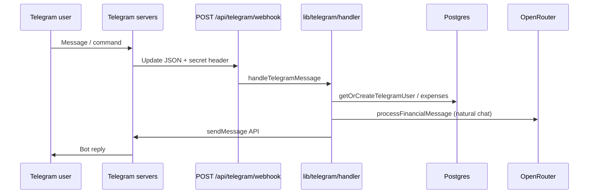

# Telegram integration

Smart Birr uses a **Telegram Bot** with **webhooks** (not long polling). Incoming messages hit your deployed app; the bot replies via the Telegram Bot API. Users can chat with the bot standalone, or **link** their Telegram account to a web dashboard account for a single financial profile.

## Architecture



| Piece | Location |
|-------|----------|
| Webhook endpoint | `app/api/telegram/webhook/route.ts` |
| Register webhook | `app/api/telegram/setup/route.ts` |
| Bot API helpers | `lib/telegram/bot.ts` |
| Message routing & commands | `lib/telegram/handler.ts` |
| Dashboard linking | `app/actions/telegram.ts`, `components/settings/telegram-settings.tsx` |
| Scheduled Telegram messages | `lib/cron/telegram-jobs.ts` via Vercel Cron |

---

## 1. Create a bot

1. Open Telegram and message [@BotFather](https://t.me/BotFather).
2. Send `/newbot`, follow the prompts, and copy the **bot token** (looks like `123456789:ABCdef...`).
3. Optional: set description, commands, and profile picture via BotFather.

Keep the token secret. Anyone with it can control your bot.

---

## 2. Environment variables

Add these to `.env` locally and to **Vercel → Settings → Environment Variables** for production.

| Variable | Required | Description |
|----------|----------|-------------|
| `TELEGRAM_BOT_TOKEN` | Yes | Bot token from BotFather |
| `TELEGRAM_WEBHOOK_SECRET` | Strongly recommended in production | Random string (e.g. 32+ hex chars). Telegram sends it as `X-Telegram-Bot-Api-Secret-Token` on every webhook POST |
| `TELEGRAM_SETUP_KEY` | Yes in production | Random string used to protect `GET /api/telegram/setup` |
| `NEXT_PUBLIC_APP_URL` | Yes for webhook setup | Public HTTPS base URL, e.g. `https://smart-birr.vercel.app` (no trailing slash) |
| `OPENROUTER_API_KEY` | Yes for AI replies | Used when users send natural-language messages |
| `OPENROUTER_MODEL` | No | Defaults to `deepseek/deepseek-chat` (no trailing spaces). Avoid `google/gemini-*` unless you have your own API key — shared Gemini hits 429 rate limits often |
| `OPENROUTER_EXTRACTION_MODEL` | No | Model for parsing “spent 500 on lunch” (default `deepseek/deepseek-chat`) |
| `OPENROUTER_MAX_TOKENS_TELEGRAM` | No | Max reply tokens for Telegram (default `480`). Lower this if you see OpenRouter 402 credit errors |
| `OPENROUTER_MAX_TOKENS` | No | Max reply tokens for web chat (default `800`) |
| `DATABASE_URL` | Yes | Postgres; Telegram users are stored in `users.telegram_id` |
| `CRON_SECRET` | Yes on Vercel | Protects `/api/cron/*`; Vercel sends `Authorization: Bearer <CRON_SECRET>` |

Generate secrets (example):

```bash
openssl rand -hex 32
```

Example `.env` (placeholders only):

```env
TELEGRAM_BOT_TOKEN=your_bot_token
TELEGRAM_WEBHOOK_SECRET=your_webhook_secret
TELEGRAM_SETUP_KEY=your_setup_key
NEXT_PUBLIC_APP_URL=https://your-app.vercel.app
```

`.env` is gitignored and is **not** deployed to Vercel—you must set variables in the Vercel dashboard and redeploy.

---

## 3. Register the webhook

After the app is deployed over **HTTPS**, register the webhook once (or again after changing domain or secret).

### Production (Vercel)

```http
GET https://your-app.vercel.app/api/telegram/setup?key=YOUR_TELEGRAM_SETUP_KEY
```

Successful response shape:

```json
{
  "webhookUrl": "https://your-app.vercel.app/api/telegram/webhook",
  "webhookSecretConfigured": true,
  "result": { "ok": true, "description": "Webhook was set" },
  "hint": "Webhook secret registered with Telegram."
}
```

Rules enforced by the setup route:

- In **production**, `TELEGRAM_SETUP_KEY` must be set; the `key` query param must match.
- `NEXT_PUBLIC_APP_URL` must be set (or the app must run on Vercel with `VERCEL_URL` available during setup).
- The webhook URL is always `{baseUrl}/api/telegram/webhook`.

### Local development

Telegram only delivers webhooks to **public HTTPS** URLs. Options:

1. **Tunnel** (recommended): use [ngrok](https://ngrok.com), [Cloudflare Tunnel](https://developers.cloudflare.com/cloudflare-one/connections/connect-apps/), etc.

   ```bash
   ngrok http 3000
   ```

   Set `NEXT_PUBLIC_APP_URL=https://YOUR-NGROK-SUBDOMAIN.ngrok-free.app`, restart the dev server, then call setup (setup key optional when `NODE_ENV` is not `production`):

   ```http
   GET http://localhost:3000/api/telegram/setup
   ```

2. **Deploy a preview** on Vercel and run setup against the preview URL.

### Manual registration (optional)

You can call Telegram’s API directly instead of the setup route:

```bash
curl -X POST "https://api.telegram.org/bot<TOKEN>/setWebhook" \
  -H "Content-Type: application/json" \
  -d '{
    "url": "https://your-app.vercel.app/api/telegram/webhook",
    "allowed_updates": ["message", "callback_query"],
    "secret_token": "YOUR_TELEGRAM_WEBHOOK_SECRET"
  }'
```

Check status:

```bash
curl "https://api.telegram.org/bot<TOKEN>/getWebhookInfo"
```

---

## 4. Webhook security

`POST /api/telegram/webhook` accepts Telegram update JSON.

| Condition | Behavior |
|-----------|----------|
| `TELEGRAM_WEBHOOK_SECRET` is set | Request must include header `X-Telegram-Bot-Api-Secret-Token` with the same value, or **401 Unauthorized** |
| Secret not set, `NODE_ENV=production` | Webhook still runs; a **warning** is logged (anyone could POST fake updates) |
| Secret not set, development | Webhook runs without header check |

When `TELEGRAM_WEBHOOK_SECRET` is set, `setWebhook` (via setup or `lib/telegram/bot.ts`) registers the same value with Telegram as `secret_token`.

The handler always returns `{ ok: true }` on unexpected errors so Telegram does not retry indefinitely; errors are logged server-side.

---

## 5. User accounts: bot-only vs linked

### Bot-only users

The first message from a Telegram user calls `getOrCreateTelegramUser`, which inserts a `users` row with `telegram_id` set and no `auth_user_id`. They can log expenses, use `/budget`, `/report`, and AI chat immediately.

### Link to the web dashboard

To merge Telegram activity with a Supabase-authenticated web account:

1. Message the bot: `/chatid`
2. Copy the **User ID** (numeric).
3. In the app: **Dashboard → Settings → Telegram**, paste the ID and save.

`linkTelegramId` stores that ID on your web user. Each Telegram ID can only belong to one app user.

If the ID is already linked elsewhere, you’ll see an error—unlink the other account or use the same Telegram account you used with the bot.

### Unlink

**Settings → Unlink Telegram** clears `telegram_id` on your web user. The bot-only row (if any) remains in the database until you clean it up manually.

---

## 6. Bot commands

| Command | Description |
|---------|-------------|
| `/start` | Welcome message |
| `/help` | Command list |
| `/budget` | Show or generate monthly budget (needs income) |
| `/savings` | Savings check for the current month |
| `/report` | Spending summary for the current month |
| `/expense` | How to log expenses in plain language |
| `/chatid` | Show Chat ID and User ID for dashboard linking |

**Natural language** (any other text) is handled by `processFinancialMessage` with `channel: "telegram"`—for example:

- `Spent 500 birr on lunch`
- `My income is 20000 birr per month`
- `Can I afford to save 5000 this month?`

Replies use HTML formatting (`parse_mode: HTML`).

---

## 7. Scheduled messages (Vercel Cron)

`vercel.json` defines cron jobs that call protected routes with `Authorization: Bearer <CRON_SECRET>`:

| Schedule (UTC) | Route | Telegram behavior |
|----------------|-------|-------------------|
| Daily `0 18 * * *` | `/api/cron/nightly` | Daily summary or “log expenses” reminder |
| Sunday `0 9 * * 0` | `/api/cron/weekly` | Weekly spending report |
| 1st of month `0 9 1 * *` | `/api/cron/monthly` | Monthly analysis |

Only users with a non-null `users.telegram_id` receive messages. Cron uses `telegram_id` as the **chat ID** (correct for private chats with the bot).

Set `CRON_SECRET` in Vercel; Vercel injects it automatically for cron invocations when configured in the project.

---

## 8. Deployment checklist

- [ ] `TELEGRAM_BOT_TOKEN` set on Vercel
- [ ] `TELEGRAM_WEBHOOK_SECRET` set (recommended)
- [ ] `TELEGRAM_SETUP_KEY` set
- [ ] `NEXT_PUBLIC_APP_URL` = production URL
- [ ] `DATABASE_URL`, `OPENROUTER_API_KEY`, `CRON_SECRET` set
- [ ] Redeploy after env changes
- [ ] Call `GET /api/telegram/setup?key=...` once
- [ ] Message the bot `/start` and test a command
- [ ] Link Telegram ID in dashboard settings (optional)
- [ ] Confirm `getWebhookInfo` shows your URL and no last error

---

## 9. Troubleshooting

### Inline buttons (category picker) do nothing

- Telegram only sends button clicks if `callback_query` is in **allowed_updates**.
- Call setup again (it registers both `message` and `callback_query`):

  ```http
  GET https://your-app.vercel.app/api/telegram/setup?key=YOUR_TELEGRAM_SETUP_KEY
  ```

- Confirm `getWebhookInfo` → `allowed_updates` includes `callback_query`.
- After fixing the webhook, tap **📝 Log expense** again so you get fresh category buttons.

### Bot does not reply

- Confirm webhook is set: `getWebhookInfo` → `url` should match your deployment.
- Check Vercel **Functions** logs for `Telegram webhook error`.
- Ensure `TELEGRAM_BOT_TOKEN` is set in the deployment environment.
- If you use `TELEGRAM_WEBHOOK_SECRET`, re-run setup **after** setting the secret so Telegram stores the same token.

### `401` on webhook

- `X-Telegram-Bot-Api-Secret-Token` does not match `TELEGRAM_WEBHOOK_SECRET`.
- Fix: align the env var and call setup again, or temporarily remove the secret and re-register (not recommended in production).

### Setup returns `403`

- In production, `TELEGRAM_SETUP_KEY` is required and `?key=` must match.

### Setup returns `400` — missing URL

- Set `NEXT_PUBLIC_APP_URL` to your public HTTPS origin.

### AI messages fail but commands work

- Check `OPENROUTER_API_KEY` and Vercel logs for OpenRouter errors.
- **402 / insufficient credits**: add credits at [OpenRouter settings](https://openrouter.ai/settings/credits), or set `OPENROUTER_MAX_TOKENS_TELEGRAM=400` (or lower) in Vercel env and redeploy. Guided expense logging (📝 Log expense) does not use AI.
- **429 / rate limit**: set `OPENROUTER_MODEL=deepseek/deepseek-chat` in Vercel (not Gemini), wait a minute, or add your own provider key at [OpenRouter integrations](https://openrouter.ai/settings/integrations).

### Cron messages never arrive

- User must have `telegram_id` linked (bot-only user created via `/start` already has one).
- `CRON_SECRET` must be set; cron routes return **401** if missing.
- Vercel Cron requires a Pro plan for some schedules—verify cron execution in the Vercel dashboard.

### Linking fails: “already linked to another account”

- That Telegram User ID is on a different `users` row. Unlink from the other account or use the matching Telegram account.

---

## 10. File reference

```
app/api/telegram/webhook/route.ts   # Incoming updates
app/api/telegram/setup/route.ts     # setWebhook helper
lib/telegram/bot.ts                 # sendMessage, setWebhook, HELP_TEXT
lib/telegram/handler.ts             # Commands + AI routing
lib/cron/telegram-jobs.ts           # Nightly / weekly / monthly pushes
lib/users/service.ts                # getOrCreateTelegramUser, linkTelegramId
```

For general env vars (Supabase, database), see deployment notes in the project README or Vercel environment settings.
